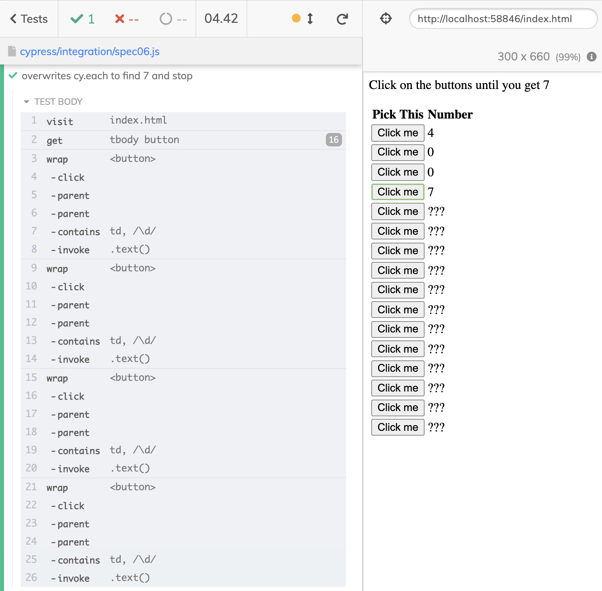

# better-cypress-each-example 

> Playing with `cy.each` command

Read the blog post [A Better cy.each Iteration](https://glebbahmutov.com/blog/better-cy-each/)

<!-- prettier-ignore-start -->
Spec | Description
---|---
[spec01.js](./cypress/integration/spec01.js) | Quickly clicks every button using [cy.each](https://on.cypress.io/each)
[spec02.js](./cypress/integration/spec02.js) | Clicks on the button and waits for the cell to reveal its number
[spec03.js](./cypress/integration/spec03.js) | Stops the `cy.each` execution from a synchronous callback by returning `false`
[spec04.js](./cypress/integration/spec04.js) | Stops the `cy.each` execution when it finds the number 7
[spec05.js](./cypress/integration/spec05.js) | Uses `each` from [cypress-recurse](https://github.com/bahmutov/cypress-recurse) to iterate and stop when it sees the number 7
[spec06.js](./cypress/integration/spec06.js) | Overwrites the `cy.each` command to use the `each` function from [cypress-recurse](https://github.com/bahmutov/cypress-recurse) plugin
<!-- prettier-ignore-end -->

## Videos

These videos are in the YouTube Playlist "[Advanced cy.each Examples](https://www.youtube.com/watch?v=FTjWAeCWpHQ&list=PLP9o9QNnQuAaa6uBRY5G9CdOWBcMg2K-r)"

- [Iterate Over Table Rows And Click A Button In Each Row Using cy.each Command](https://youtu.be/M0RxEeJaq_E)
- [How To Stop cy.each Iterations For Simple Cases](https://youtu.be/lhb5Lt9RwE4)
- [Stop cy.each Iteration When Using Cypress Commands Inside The Callback Function](https://youtu.be/G4xs9_cAm2c)
- [Cy.each Yields The Original Subject](https://youtu.be/DyPr8Dq9D58)
- [Use each Function From cypress-recurse Plugin To Iterate And Stop](https://youtu.be/a-LErnTG1lU)
- [Overwrite The cy.each Command](https://youtu.be/8LcTNeILQtQ)

## Small print

Author: Gleb Bahmutov &lt;gleb.bahmutov@gmail.com&gt; &copy; 2022

- [@bahmutov](https://twitter.com/bahmutov)
- [glebbahmutov.com](https://glebbahmutov.com)
- [blog](https://glebbahmutov.com/blog)
- [videos](https://www.youtube.com/glebbahmutov)
- [presentations](https://slides.com/bahmutov)
- [cypress.tips](https://cypress.tips)
- [Cypress Tips & Tricks Newsletter](https://cypresstips.substack.com/)

License: MIT - do anything with the code, but don't blame me if it does not work.

Support: if you find any problems with this module, email / tweet /
[open issue](https://github.com/bahmutov/better-cypress-each-example/issues) on Github

## MIT License

Copyright (c) 2022 Gleb Bahmutov &lt;gleb.bahmutov@gmail.com&gt;

Permission is hereby granted, free of charge, to any person
obtaining a copy of this software and associated documentation
files (the "Software"), to deal in the Software without
restriction, including without limitation the rights to use,
copy, modify, merge, publish, distribute, sublicense, and/or sell
copies of the Software, and to permit persons to whom the
Software is furnished to do so, subject to the following
conditions:

The above copyright notice and this permission notice shall be
included in all copies or substantial portions of the Software.

THE SOFTWARE IS PROVIDED "AS IS", WITHOUT WARRANTY OF ANY KIND,
EXPRESS OR IMPLIED, INCLUDING BUT NOT LIMITED TO THE WARRANTIES
OF MERCHANTABILITY, FITNESS FOR A PARTICULAR PURPOSE AND
NONINFRINGEMENT. IN NO EVENT SHALL THE AUTHORS OR COPYRIGHT
HOLDERS BE LIABLE FOR ANY CLAIM, DAMAGES OR OTHER LIABILITY,
WHETHER IN AN ACTION OF CONTRACT, TORT OR OTHERWISE, ARISING
FROM, OUT OF OR IN CONNECTION WITH THE SOFTWARE OR THE USE OR
OTHER DEALINGS IN THE SOFTWARE.
